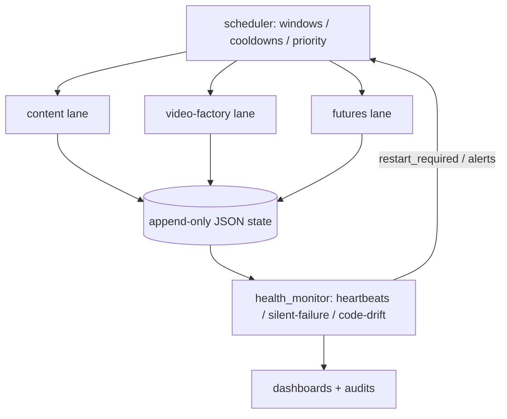
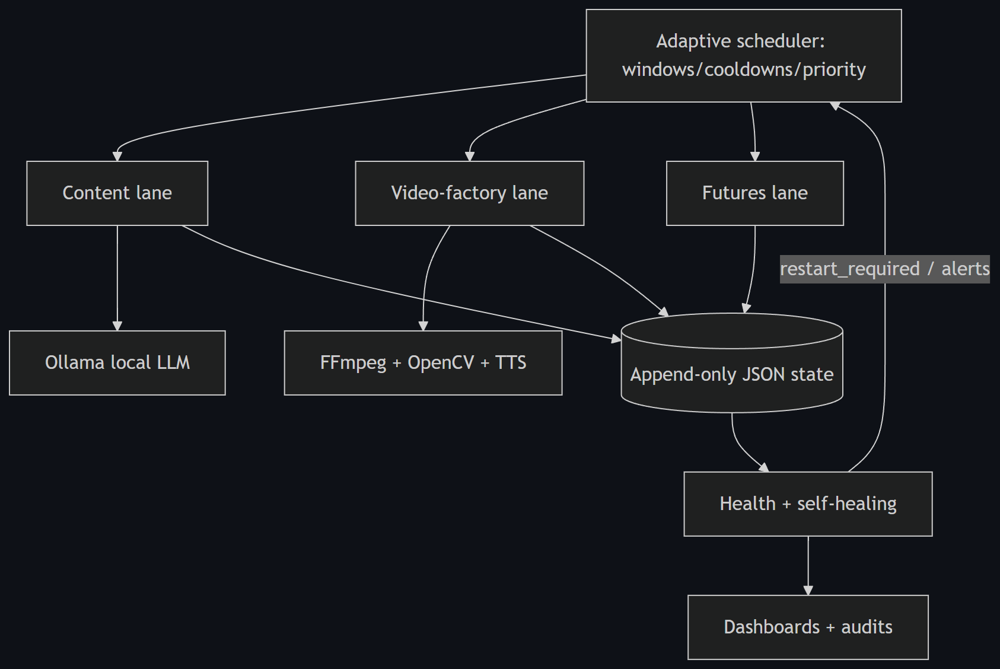

# Architecture — Local AI Orchestrator

> Representative/cleaned subset. Single machine, local-first, $0 infrastructure.

## Model

## Modules in this showcase

| File | Responsibility |
| --- | --- |
| `src/scheduler.py` | Evaluates lanes by time window, cooldown, priority |
| `src/lane.py` | The unit of work; failures are contained, never propagated |
| `src/health_monitor.py` | Heartbeat staleness, silent-failure, **code-drift** detection |
| `src/state_store.py` | Atomic, append-only JSON state |

## Why lanes + a scheduler

A single mega-loop fails as a unit. Independent lanes mean a broken lane is a
local incident: the scheduler keeps running the others, and `lane.run_lane`
turns an exception into a failed *result* rather than a crash.

## Why append-only JSON state

Plain-text state is inspectable and recoverable. `state_store.write_atomic`
writes a temp file then `os.replace`, so a crash mid-write can't corrupt state.
See `demo_data/sample_state.json` and `observability/sample_ecosystem_health.json`.

## Not in this subset

The real FFmpeg/OpenCV/TTS video factory, the Ollama wrappers, and the Windows
Task-Scheduler startup layer are summarized here and shown via the video-factory
sample, but kept out of the public code.
